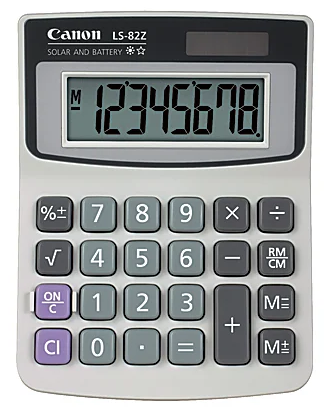

# Calculator++ Kata

This repo contains starter code for a TDD kata in TypeScript.

The goal of this exercise is to mimic the behavior and UX of an electronic desktop calculator like this one:



I recommend obtaining such a calculator, and then making your code do what it does.
That way, the calculator can serve as an [oracle](https://github.com/benchristel/benchristel.github.io/wiki/Oracle) that always gives the right answer to questions of the form "what should my app do when...?" On a real project,
of course, the product manager would field these questions.

Here are some things to think about while doing the exercise:

- How can I test the calculator logic without invoking the UI code or sensing the state of the LCD segments?
- How can I make my test assertions easier to read, and more obviously correct?
- What's the best way to hook up the calculator logic to the UI?

## Getting Started

1. Click the "Use this template" button on GitHub
2. Clone the created repo
3. Run the one-time setup script to install dependencies and git hooks:
   ```
   yarn setup
   ```

## Development

### Guide to Files

The file `src/App.tsx` contains a mockup of the UI, with none of the functionality implemented. The `src/lib` folder contains files you shouldn't need to change.

### Server and Typechecker

```
yarn dev
yarn ts
```

- Opening the project in **Visual Studio Code** automatically starts the dev server and `typescript` typechecker.
- The dev server runs at http://localhost:5173 (the port number is `vite` in 1337... sort of).
- Output appears in the terminal pane (accessed via `ctrl+~`).
- Type errors also show up in the problems pane (`ctrl+shift+M`).
- The server and typechecker stop automatically when VS Code quits.

### Tests

http://localhost:5173

The test framework is [@benchristel/taste](https://github.com/benchristel/taste). You can add tests in any file, and they will be run automatically in the browser as long as the file is `import`ed somewhere. Here is an example of a Taste test:

```js
test("a calculator", {
  "displays zero when first turned on"() {
    const calculator = new Calculator()
    expect(calculator.display(), equals, {digits: "0"})
  },
})
```

Some things to note:

- The test report appears at the top of the page when running the dev server.
- The page will refresh (re-running the tests) whenever you save a file.
- The tests and test report are completely removed from production builds.

### Formatting

- Files get auto-formatted when you commit, so you'll never check in inconsistently-formatted code. To disable this behavior, delete `.husky/pre-commit`.
- To format all files, run `yarn format`.
- The code formatter is `prettier`. See `.prettierrc` for configuration.

## Building for production

```
yarn build
```

To smoketest your production build before deploying it, I recommend installing `serve`:

```
yarn global add serve
serve dist
```

You can then view your app at http://localhost:3000.

## Deploying

To deploy your built app to GitHub Pages, go to the `Pages` tab of your repo's settings and change the directory to deploy from to `/docs`.

## Extra Credit

Once you've implemented the basics, you can extend the kata in the following ways:

- Save the calculator's state in local storage, so it persists across page refreshes.
  Can you do it (and test the interesting logic) without touching the real `localStorage` in
  your tests?
- Make the calculator automatically "turn itself off" after 15 minutes of inactivity. Can
  you test the logic without actually waiting 15 minutes?
